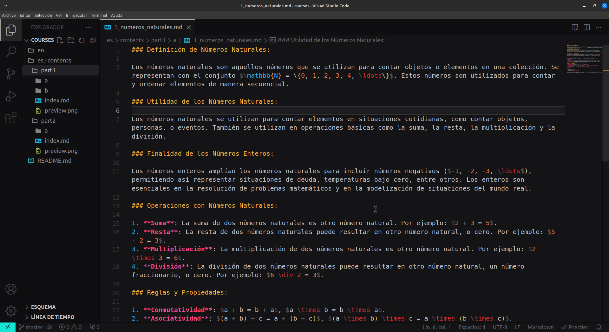

# Maths Predators

Este repositorio contiene los materiales y contenidos del curso de matemáticas ofrecido por Maths Predators. Los materiales están organizados por módulos y temas, y se presentan en formato Markdown para una fácil lectura y acceso.

## Estructura del Repositorio

- Cada módulo del curso tiene su propia carpeta, identificada con un nombre descriptivo que indica el tema principal del módulo.
- Dentro de cada carpeta de módulo, se encuentran archivos Markdown que contienen los materiales del curso para cada tema específico.
- Los archivos Markdown están organizados de manera lógica y coherente, con un formato claro que incluye explicaciones, ejemplos y ejercicios prácticos.

## Contribuciones

¡Se anima a los colaboradores a contribuir con mejoras, correcciones y adiciones al contenido del curso! Las solicitudes de extracción (pull requests) son bienvenidas para enriquecer y mejorar la calidad del material. Se espera que todas las contribuciones estén alineadas con el objetivo de hacer que el curso sea accesible, comprensible y útil para estudiantes de matemáticas de todos los niveles.

## Licencia

Este repositorio se distribuye bajo la Licencia MIT, lo que significa que el contenido del curso es de uso gratuito y está abierto para que cualquiera lo utilice, modifique y comparta de acuerdo con los términos de dicha licencia.

## Nota

Por favor, asegúrate de respetar las reglas y normas de la comunidad al contribuir al repositorio y utilizar el contenido del curso. Si tienes preguntas o sugerencias, no dudes en abrir un problema (issue) o ponerte en contacto con el administrador del repositorio.
